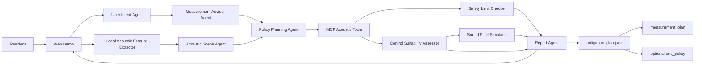

# NoiceCance

Version: 3 - Local-first noise assessment prototype

NoiceCance is a local-first multi-agent prototype for helping people understand a noise problem, plan safe measurements, analyze privacy-preserving acoustic features, and choose realistic mitigation steps.

The judge-facing web demo currently includes:

- Homes facing a two-way six-lane intersection.
- Homes near an airport.
- A high-frequency or impulsive noise case that should reject ANC.
- A custom local assessment mode for user-written complaints.

Future extension scenarios may include truck cabins near highways, shared apartments, classrooms, workshops, and other high-noise work environments.

The project is intended for the Kaggle AI Agents: Intensive Vibe Coding Capstone Project in the Agents for Good track.

## Project Concept

NoiceCance converts a noise complaint into an evidence-based workflow: understand the user's goal, recommend what to measure, analyze the noise profile, decide which controls are physically appropriate, and export `mitigation_plan.json`.

The static web demo is a scenario gallery and judge-facing interface. The intended product is a local deployable agent system: raw audio stays on the user's machine, agents extract only derived acoustic features, and the final report explains the evidence, measurement gaps, safety constraints, and recommended controls.

NoiceCance is not a universal active-noise-control generator. ANC is only one possible control family. If a noise profile is dominated by high-frequency, impulsive, unpredictable, or highly reverberant sound, the system should reject ANC and recommend passive insulation, room changes, masking sound, engineering controls, or hearing protection instead.

If the noise profile contains plausible low-frequency components, such as traffic rumble or aircraft low-frequency events near a bed-side quiet zone, the mitigation plan may include an optional `anc_policy` section for a future deployable unit. That unit would require microphones, speakers, calibration, and local DSP.

The real-time acoustic control path is designed to be local-first. An LLM should not be required for low-latency audio cancellation. Agents are used at the supervisory layer for intent understanding, measurement planning, scene analysis, policy planning, safety review, explanation, and report generation.

## Planned Capabilities

- Free-text noise complaint analysis.
- Built-in scenarios for intersection and airport-adjacent housing.
- Custom local assessment mode.
- Measurement planning: where to measure, when to measure, what observations to log, and which derived features to extract.
- Optional local audio feature extraction.
- Multi-agent planning with ADK.
- MCP tools for acoustic analysis, simulation, safety checks, and policy export.
- Offline mode using scenario templates and deterministic rules.
- Web visualization of noise sources, quiet zones, microphone placement, speaker placement, and expected mitigation.
- Exportable `mitigation_plan.json` with `measurement_plan`, `observed_features`, `analysis_conclusion`, and optional `anc_policy`.
- Optional `anc_policy` section only when local low-frequency active control is suitable.
- Explicit refusal of ANC when the physics or safety constraints do not support it.

## Local Deterministic Demo

The first implementation layer is a standard-library Python core. It does not require an LLM, network access, or new dependencies.

From this repository root:

```powershell
conda run -n cvuni python src\noicecance_core\demo.py --scenario intersection
conda run -n cvuni python src\noicecance_core\demo.py --scenario airport
conda run -n cvuni python src\noicecance_core\demo.py --scenario high_frequency
conda run -n cvuni python src\noicecance_core\demo.py --scenario custom --complaint "Low hum after midnight near the bedroom wall."
```

The generated output follows [schemas/mitigation_plan.schema.json](schemas/mitigation_plan.schema.json). Example plans are in [examples/](examples/).

## Local Tool Adapter Demo

The next layer exposes the same deterministic core as JSON-like tool functions. This is the interface that a future MCP server or ADK agent can call.

```powershell
conda run -n cvuni python src\noicecance_core\tools_demo.py analyze --scenario intersection
conda run -n cvuni python src\noicecance_core\tools_demo.py assess --scenario airport
conda run -n cvuni python src\noicecance_core\tools_demo.py generate --scenario airport
conda run -n cvuni python src\noicecance_core\tools_demo.py check --scenario high_frequency
```

## Local Multi-Agent Loop Demo

The local loop simulates the planned multi-agent workflow without requiring an LLM, ADK project, or MCP server. It records a trace for:

- User Intent Agent
- Acoustic Scene Agent
- Measurement Advisor Agent
- Policy Planning Agent
- Safety & Privacy Agent
- Report Agent

```powershell
conda run -n cvuni python src\noicecance_core\agent_loop_demo.py --scenario intersection
conda run -n cvuni python src\noicecance_core\agent_loop_demo.py --scenario custom --complaint "Low hum after midnight near the bedroom wall."
conda run -n cvuni python src\noicecance_core\agent_loop_demo.py --scenario high_frequency --force-unsafe-first-draft
```

The `--force-unsafe-first-draft` mode intentionally creates an unsafe ANC proposal so the Safety & Privacy Agent can reject it and trigger a planner revision.

## Static Web Demo

Open [web/index.html](web/index.html) in a browser. The static demo runs entirely in the browser with no build step, server, network access, or new dependencies.

It includes scenario switching, custom complaint input, an agent trace, measurement targets, sound-field visualization, control suitability, recommended and blocked controls, an evidence conclusion, and exportable `mitigation_plan.json`.

## MCP-Like Stdio Tool Bridge

The current bridge is dependency-free and MCP-like, not an official MCP SDK server. It uses newline-delimited JSON with two methods:

- `list_tools`
- `call_tool`

Client demo:

```powershell
conda run -n cvuni python src\noicecance_core\stdio_tool_client_demo.py --scenario high_frequency
```

Direct server example:

```powershell
'{"id":"1","method":"list_tools"}' | conda run -n cvuni python src\noicecance_core\stdio_tool_server.py
```

The next integration step is to wrap the same `TOOLS` registry with an official MCP server after approving any required dependency.

## Safety Boundaries

- NoiceCance does not provide medical diagnosis.
- NoiceCance does not replace professional acoustic engineering, occupational safety, or hearing-protection advice.
- The prototype does not claim that laptop speakers can cancel real traffic or aircraft noise at room scale.
- The prototype does not claim that ultrasonic transducers can directly cancel audible traffic or aircraft noise.
- The prototype does not treat ANC as a universal solution for high-frequency, impulsive, unpredictable, or complex reverberant noise.
- Raw audio should not be uploaded or stored by default.
- Safety-critical sounds such as alarms, sirens, smoke detectors, and urgent human speech must be preserved.
- Output levels and ANC policies must remain within conservative safety limits.

## Architecture Draft



## Deployment Path

### Phase 1: Local Web Demo

The first implementation should run locally on a laptop and support both connected and offline use:

- Connected mode: agents can generate personalized plans from the user's text and local derived features.
- Offline mode: users can select built-in scenarios, enter a custom complaint, and inspect deterministic recommendations.

### Phase 2: Containerized Demo

After the local version works, the project can add a Docker-based path for repeatable judging and deployment.

### Phase 3: Hardware Integration Target

The exported `mitigation_plan.json` should be compatible with future deployment targets. If ANC is suitable, it may contain an `anc_policy` for a future unit made from microphones, speaker arrays, calibration routines, and local DSP. If ANC is unsuitable, the same plan should explain why and recommend non-ANC controls.

The capstone prototype will simulate this target rather than claiming full hardware performance.

## Current Status

Specification draft, deterministic planning core, local measurement workflow, local tool adapters, local multi-agent loop, MCP-like stdio bridge, static web demo, example plans, and focused deterministic tests are in place. Official MCP and ADK integration have not started yet.
