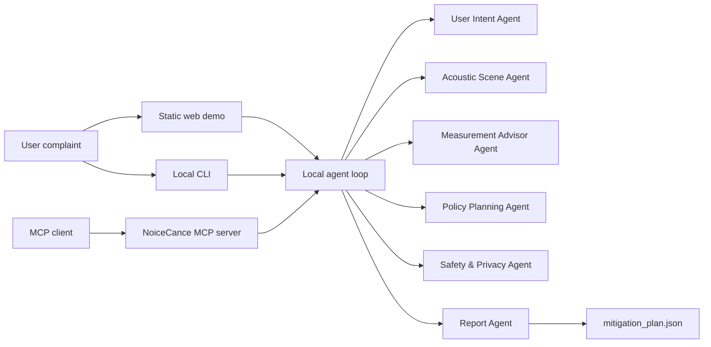

# NoiceCance

Local-first noise assessment agents for turning a vague noise complaint into a safe measurement plan and evidence-based mitigation report.

NoiceCance was built for the Kaggle AI Agents: Intensive Vibe Coding Capstone Project in the Agents for Good track. The project focuses on a practical safety point: active noise cancellation is not a universal answer. The agent workflow first asks what should be measured, whether the noise profile is physically suitable for active control, and which non-ANC controls should be prioritized when ANC is unsafe or unrealistic.

## What It Does

NoiceCance converts a user complaint such as "low hum after midnight near the bedroom wall" into a structured `mitigation_plan.json` containing:

- `measurement_plan`: where, when, and what to measure.
- `noise_profile`: source classes, dominant bands, event pattern, and confidence.
- `control_suitability`: suitability of near-field ANC, passive insulation, masking, and hearing protection.
- `recommended_controls` and `blocked_controls`: practical options and refused options.
- `analysis_conclusion`: a plain-language decision and next step.
- optional `anc_policy`: included only for plausible low-frequency quiet-zone cases.

The project is local-first. Raw audio is not uploaded or retained by default. The current prototype uses complaint text and optional derived feature dictionaries; real `.wav` ingestion is intentionally not implemented yet.

## Implemented

- Static browser demo with built-in scenarios and custom complaint input.
- Local CLI for free-text assessment and JSON export.
- Deterministic Python planning core.
- Local multi-agent loop with trace events and safety revision.
- Official MCP server built with the MCP Python SDK.
- Dependency-free MCP-like stdio bridge for transparent tool-adapter inspection.
- JSON schema and example plans.
- Deterministic tests covering safety gates, CLI behavior, MCP tools, and input-quality handling.

## Quick Start

From the repository root, install the pinned MCP dependency:

```powershell
python -m pip install -r requirements.txt
```

Run the test suite:

```powershell
python -m unittest discover -s tests
```

If you are using the local `cvuni` conda environment:

```powershell
conda run -n cvuni python -m pip install -r requirements.txt
conda run -n cvuni python -m unittest discover -s tests
```

Expected result:

```text
Ran 22 tests
OK
```

## Web Demo

Open [web/index.html](web/index.html) in a browser. No build step, server, cloud account, or API key is required.

The web demo includes:

- Six-lane intersection resident.
- Airport-adjacent home.
- High-frequency impulsive noise case that blocks ANC.
- Custom local assessment for user-written complaints.

Try these checks:

1. Select the high-frequency case and confirm ANC is blocked.
2. Enter `Low hum after midnight near the bedroom wall.` in custom mode.
3. Enter `hello` and confirm the app asks for noise details instead of inventing a plan.
4. Export `mitigation_plan.json`.

## Local CLI

The CLI is the simplest local workflow entry point. It runs the same deterministic agent loop as the web demo.

```powershell
python src\noicecance_core\cli.py assess --complaint "Low hum after midnight near the bedroom wall."
```

Export the full agent-loop result:

```powershell
python src\noicecance_core\cli.py assess --complaint "Sharp high-pitched unpredictable sound near the window." --out outputs\mitigation_plan.json
```

Example behavior:

- Low-frequency hum: produces a measurement-first plan and may allow limited near-field ANC as a future option.
- High-frequency or impulsive noise: blocks ANC and recommends passive, source, or hearing-protection controls.
- Irrelevant input such as `hello`: returns `needs_noise_description` and asks for structured noise context.

## Official MCP Server

NoiceCance includes an official MCP server built with `mcp==1.28.1`. It exposes local assessment tools without shell access, arbitrary file reads, raw-audio upload, or external service calls.

Start the stdio server for an MCP client:

```powershell
python src\noicecance_core\mcp_server.py --transport stdio
```

When run manually, this command waits for MCP protocol messages until stopped. It is meant to be launched by an MCP client.

Available MCP tools:

- `analyze_noise_profile`
- `generate_mitigation_plan`
- `run_agent_loop`
- `check_safety_limits`

Example MCP client command configuration:

```json
{
  "command": "python",
  "args": [
    "C:\\path\\to\\noicecance-capstone\\src\\noicecance_core\\mcp_server.py"
  ]
}
```

## Other Local Demos

Generate a mitigation plan directly from the deterministic core:

```powershell
python src\noicecance_core\demo.py --scenario intersection
python src\noicecance_core\demo.py --scenario airport
python src\noicecance_core\demo.py --scenario high_frequency
python src\noicecance_core\demo.py --scenario custom --complaint "Low hum after midnight near the bedroom wall."
```

Run the deterministic multi-agent loop:

```powershell
python src\noicecance_core\agent_loop_demo.py --scenario custom --complaint "Low hum after midnight near the bedroom wall."
python src\noicecance_core\agent_loop_demo.py --scenario high_frequency --force-unsafe-first-draft
```

Inspect the dependency-free MCP-like stdio bridge:

```powershell
python src\noicecance_core\stdio_tool_client_demo.py --scenario high_frequency
```

## Architecture



Agent roles:

- User Intent Agent: infers user goal, privacy preference, and safety assumptions.
- Acoustic Scene Agent: classifies complaint text and optional derived features.
- Measurement Advisor Agent: recommends measurement targets and observations.
- Policy Planning Agent: generates the mitigation plan and optional ANC policy.
- Safety & Privacy Agent: blocks unsafe ANC and privacy violations.
- Report Agent: produces the final explanation and JSON output.

## Course Concepts

The capstone demonstrates these course concepts:

- Multi-agent system: deterministic agent roles, shared state, trace events, and safety revision.
- MCP Server: official MCP server exposing NoiceCance tools.
- Security features: local-first design, raw-audio non-retention, safety-critical sound preservation, and refusal of unsupported ANC.
- Agent skills / CLI: command-line workflow for local assessment.
- Deployability: static web demo and local Python commands that require no cloud service.

## Safety Boundaries

- No medical diagnosis or guaranteed sleep improvement.
- No claim that laptop speakers can cancel real traffic or aircraft noise at room scale.
- No claim that ultrasonic transducers directly cancel audible environmental noise.
- No whole-room open-air ANC claims for complex reflected environments.
- Raw audio is not uploaded or retained by default.
- Safety-critical sounds such as alarms, sirens, smoke detectors, and urgent speech must be preserved.
- Real active playback would require calibrated microphones, calibrated speakers, local DSP, and conservative output limits.

## Not Implemented Yet

- Real audio recording ingestion.
- Local `.wav` feature extraction.
- LLM-backed agents.
- ADK / Agents CLI scaffold.
- Real DSP or hardware integration.
- Docker or cloud deployment.
- Physics-grade sound-field simulation.

## Repository Layout

```text
src/noicecance_core/
  core.py                 deterministic planning logic
  agent_loop.py           local multi-agent workflow
  cli.py                  local command-line assessment
  mcp_server.py           official MCP server
  tools.py                JSON-like tool adapters
  stdio_tool_server.py    dependency-free MCP-like bridge

web/
  index.html              static demo page
  app.js                  browser-side demo logic
  styles.css              demo styling

tests/
  test_agent_loop.py
  test_cli.py
  test_mcp_server.py
  test_stdio_tool_server.py
  test_tools.py

schemas/
  mitigation_plan.schema.json

examples/
  intersection_plan.json
  airport_plan.json
  high_frequency_rejected_plan.json

docs/
  writeup-draft.md
```

## Validation

Run from the repository root:

```powershell
python -m unittest discover -s tests
python -m compileall src tests
```

The latest local verification passed with 22 Python tests.

## Submission Status

Current status:

- Core prototype complete.
- CLI complete.
- Official MCP server complete.
- Kaggle writeup draft in [docs/writeup-draft.md](docs/writeup-draft.md).
- Video script draft in [docs/video-script.md](docs/video-script.md).
- Final public project links still pending.

Public project link: https://github.com/Tarnisher/noicecance-capstone

Video: https://youtu.be/giKIYIX2Uxw
